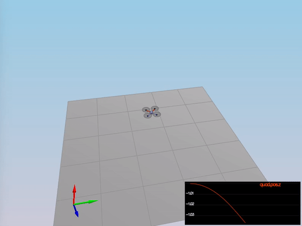

## Project: Controls

---


## [Rubric](https://review.udacity.com/#!/rubrics/1643/view) Points
Here I will consider the rubric points individually and describe how I addressed each point in my implementation.

---
### Writeup / README

#### 1. Provide a Writeup / README that includes all the rubric points and how you addressed each one.  You can submit your writeup as markdown or pdf.

You're reading it! Below I describe how I addressed each rubric point and where in my code each point is handled.

### Implemented Controller

#### 1. Implemented body rate control in python and C++.

For the Python project, first we create some a class hierarchy to simplify the creation of P and PD controllers, taking as input the current error and derivative of error, and outputting the command to minimize that error, as seen below:

```python
class PDController(object):
    def __init__(self, k_p, k_d):
        self.k_p = k_p
        self.k_d = k_d

    def control(self, error, error_dot, feed_forward=0.0):
        return self.k_p * error +  self.k_d * error_dot + feed_forward

class PController(PDController):
    def __init__(self, k_p):
        super().__init__(k_p=k_p, k_d=0.0)

    def control(self, error):
        return super().control(error, error_dot=0.0, feed_forward=0.0)
```

The controllers are initialized in the constructor of `NonLinearController`:

```python
class NonlinearController(object):
    def __init__(self):
        """Initialize the controller object and control gains"""
        # Altitude controller (PD controller)
        self.altitude_controller_ = PDController(k_p=8.0, k_d=4.0)

        # Yaw controller (P controller)
        self.yaw_controller_ = PController(k_p=5.5)

        # Body-rate controller (P controllers)
        pq_controller = PController(k_p=20.0)
        self.p_controller_ = pq_controller
        self.q_controller_ = pq_controller
        self.r_controller_ = PController(k_p=7.5)

        # Roll-pitch controller (P controllers)
        roll_pitch_controller = PController(k_p=8.0)
        self.roll_controller_ = roll_pitch_controller
        self.pitch_controller_ = roll_pitch_controller

        # Lateral controller (PD controllers)
        xy_controller = PDController(k_p=5.0, k_d=4.0)
        self.x_controller_ = xy_controller
        self.y_controller_ = xy_controller
```

Next, we implement the body-rate controller as a P controller, generating desired moments (in Nm) based on the commanded and actual body rates. We multiply the output of the P controller by the Moment of Inertia variable (`MOI`) to obtain the moment in units of Nm. Finally, the moment is constrained to take into account the physical limits of the quadcopter. This was only possible for the Python code, since no limits on torque were provided in the C++ version.

**Python code**
```python
def body_rate_control(self, body_rate_cmd, body_rate):
    """ Generate the roll, pitch, yaw moment commands in the body frame

    Args:
        body_rate_cmd: 3-element numpy array (p_cmd,q_cmd,r_cmd) in radians/second^2
        body_rate: 3-element numpy array (p,q,r) in radians/second^2

    Returns: 3-element numpy array, desired roll moment, pitch moment, and yaw moment commands in Newtons*meters
    """
    moment_p = MOI[0] * self.p_controller_.control(body_rate_cmd[0] - body_rate[0])
    moment_q = MOI[1] * self.q_controller_.control(body_rate_cmd[1] - body_rate[1])
    moment_r = MOI[2] * self.r_controller_.control(body_rate_cmd[2] - body_rate[2])

    moment_p = np.clip(moment_p, -MAX_TORQUE, MAX_TORQUE)
    moment_q = np.clip(moment_q, -MAX_TORQUE, MAX_TORQUE)
    moment_r = np.clip(moment_r, -MAX_TORQUE, MAX_TORQUE)

    return np.array([moment_p, moment_q, moment_r])
```

**C++ code**
```cpp
V3F QuadControl::BodyRateControl(V3F pqrCmd, V3F pqr)
{
    // Calculate a desired 3-axis moment given a desired and current body rate
    // INPUTS:
    //   pqrCmd: desired body rates [rad/s]
    //   pqr: current or estimated body rates [rad/s]
    // OUTPUT:
    //   return a V3F containing the desired moments for each of the 3 axes

    // HINTS:
    //  - you can use V3Fs just like scalars: V3F a(1,1,1), b(2,3,4), c; c=a-b;
    //  - you'll need parameters for moments of inertia Ixx, Iyy, Izz
    //  - you'll also need the gain parameter kpPQR (it's a V3F)

    V3F momentCmd;

    ////////////////////////////// BEGIN STUDENT CODE ///////////////////////////
    const V3F pqr_dot = kpPQR * (pqrCmd - pqr);
    momentCmd = V3F(Ixx, Iyy, Izz) * pqr_dot;
    /////////////////////////////// END STUDENT CODE ////////////////////////////

    return momentCmd;
}
```

#### 2. Implement roll pitch control in python and C++.

The roll-pitch controller takes as input the commanded acceleration (NED), the current attitude and the thrust command, and outputs the desired pitch and roll rates in body frame.

First, we obtain the current tilt `b_a_y` and `b_a_y` from the rotation matrix `R`.

Then, we compute the desired tilt `b_c_x` and `b_c_y` by normalizing the desired acceleration by the thrust. Note that we must divide it by the mass of the drone to convert it to acceleration. A negative sign is also needed since thrust is positive upwards but the acceleration is given in NED coordinates (positive down). We constrain it to a maximum and minimum tilt value to prevent the drone from fliping.

Next, a P controller determines the desired roll and pitch rate in the world frame (`b_c_x_dot` and `b_c_y_dot`).

Finally, in order to output the desired roll and pitch rate in the body frame, we apply a non-linear transformation as seen in the lectures, taking into account the rotation matrix as seen in the lectures. Below the full source code is presented:

**Python code**

```python
def roll_pitch_controller(self, acceleration_cmd, attitude, thrust_cmd):
    """ Generate the rollrate and pitchrate commands in the body frame

    Args:
        target_acceleration: 2-element numpy array (north_acceleration_cmd,east_acceleration_cmd) in m/s^2
        attitude: 3-element numpy array (roll, pitch, yaw) in radians
        thrust_cmd: vehicle thrust command in Newton

    Returns: 2-element numpy array, desired rollrate (p) and pitchrate (q) commands in radians/s
    """
    roll_pitch_rate_cmd = np.array([0.0, 0.0])

    if abs(thrust_cmd) > EPSILON:
        R = euler2RM(*attitude)

        if abs(R[2][2]) > EPSILON:
            # Current attitude
            b_a_x = R[0,2]
            b_a_y = R[1,2]

            # Desired attitude
            # Thrust comes with positive up, but in NED it should be positive down!
            # Also, b_* must be dimensionless so convert thrust to acceleration
            b_c_x = acceleration_cmd[0] / (-thrust_cmd / DRONE_MASS_KG)
            b_c_y = acceleration_cmd[1] / (-thrust_cmd / DRONE_MASS_KG)

            # Clip desired attitude to ensure the drone won't go upside down
            b_c_x = np.clip(b_c_x, -MAX_TILT, MAX_TILT)
            b_c_y = np.clip(b_c_y, -MAX_TILT, MAX_TILT)

            # Compute desired roll and pitch rates in world frame
            b_c_x_dot = self.roll_controller_.control(b_c_x - b_a_x)
            b_c_y_dot = self.pitch_controller_.control(b_c_y - b_a_y)

            # Convert to body frame
            M = np.array([[R[1,0], -R[0,0]],
                            [R[1,1], -R[0,1]]])
            b_c_dot = np.array([b_c_x_dot, b_c_y_dot])

            roll_pitch_rate_cmd = (1.0 / R[2,2]) * np.matmul(M, b_c_dot)
        else:
            print('R[2][2] = 0.0, cannot compute roll_pitch_rate!')
    else:
        print('thrust_cmd = 0.0, cannot compute roll_pitch_rate!')

    return roll_pitch_rate_cmd
```

**C++ code**

```cpp
V3F QuadControl::RollPitchControl(V3F accelCmd, Quaternion<float> attitude, float collThrustCmd)
{
    // Calculate a desired pitch and roll angle rates based on a desired global
    //   lateral acceleration, the current attitude of the quad, and desired
    //   collective thrust command
    // INPUTS:
    //   accelCmd: desired acceleration in global XY coordinates [m/s2]
    //   attitude: current or estimated attitude of the vehicle
    //   collThrustCmd: desired collective thrust of the quad [N]
    // OUTPUT:
    //   return a V3F containing the desired pitch and roll rates. The Z
    //     element of the V3F should be left at its default value (0)

    // HINTS:
    //  - we already provide rotation matrix R: to get element R[1,2] (python) use R(1,2) (C++)
    //  - you'll need the roll/pitch gain kpBank
    //  - collThrustCmd is a force in Newtons! You'll likely want to convert it to acceleration first

    V3F pqrCmd;
    Mat3x3F R = attitude.RotationMatrix_IwrtB();

    ////////////////////////////// BEGIN STUDENT CODE ///////////////////////////
    // Current attitude
    const float b_x_a = R(0,2);
    const float b_y_a = R(1,2);

    // Target attitude
    const float thrust_acceleration = -collThrustCmd / mass;
    const float b_x_c = accelCmd.x / (thrust_acceleration);
    const float b_y_c = accelCmd.y / (thrust_acceleration);

    // Commanded rates in world frame
    const float b_x_c_dot = kpBank * (b_x_c - b_x_a);
    const float b_y_c_dot = kpBank * (b_y_c - b_y_a);

    // Roll and pitch rates
    const float r_33_inv = 1.0F / R(2,2);
    pqrCmd.x =  r_33_inv * (R(1,0)*b_x_c_dot - R(0,0)*b_y_c_dot);
    pqrCmd.y =  r_33_inv * (R(1,1)*b_x_c_dot - R(0,1)*b_y_c_dot);
    pqrCmd.z = 0.0F;  // yaw controller set in YawControl
    /////////////////////////////// END STUDENT CODE ////////////////////////////

    return pqrCmd;
}

```

#### 3. Implement altitude control in python.

The altitude controller is a PD controller since we have a second-order system (we control acceleration to reach a desired position).
First, we compute the desired acceleration `u_1_bar` with the PD controller. Then we account for the non-linear effects of the attitude by dividing by `b_z`. Finally, we multiply the acceleration by the mass of the drone to create a thrust command in Newtons.

The full source code can be seen below:

```python
def altitude_control(self, altitude_cmd, vertical_velocity_cmd, altitude, vertical_velocity, attitude, acceleration_ff=0.0):
    """Generate vertical acceleration (thrust) command

    Args:
        altitude_cmd: desired vertical position (+up)
        vertical_velocity_cmd: desired vertical velocity (+up)
        altitude: vehicle vertical position (+up)
        vertical_velocity: vehicle vertical velocity (+up)
        attitude: the vehicle's current attitude, 3 element numpy array (roll, pitch, yaw) in radians
        acceleration_ff: feedforward acceleration command (+up)

    Returns: thrust command for the vehicle (+up)
    """
    thrust = 0.0

    R = euler2RM(*attitude)
    b_z = R[2][2]

    if abs(b_z) > EPSILON:
        error_z = altitude_cmd - altitude
        error_z_dot = vertical_velocity_cmd - vertical_velocity

        u_1_bar = self.altitude_controller_.control(error_z, error_z_dot, acceleration_ff)
        thrust = DRONE_MASS_KG * u_1_bar / b_z
        thrust = np.clip(thrust, 0.0, MAX_THRUST)
    else:
        print('b_z = 0.0, cannot compute thrust!')

    return thrust
```

#### 4. Implement altitude controller in C++.

The C++ version of the altitude controller is pretty much the same as the one in Python, since we included the integrator part in both cases.

The only difference in this case is that we are provided with constraints about the ascent and descent rate of the drone, which we take into account by constraining the commanded velocity.

The full source code is shown below:

```cpp
float QuadControl::AltitudeControl(float posZCmd, float velZCmd, float posZ, float velZ,
                                   Quaternion<float> attitude, float accelZCmd, float dt)
{
    // Calculate desired quad thrust based on altitude setpoint, actual altitude,
    //   vertical velocity setpoint, actual vertical velocity, and a vertical
    //   acceleration feed-forward command
    // INPUTS:
    //   posZCmd, velZCmd: desired vertical position and velocity in NED [m]
    //   posZ, velZ: current vertical position and velocity in NED [m]
    //   accelZCmd: feed-forward vertical acceleration in NED [m/s2]
    //   dt: the time step of the measurements [seconds]
    // OUTPUT:
    //   return a collective thrust command in [N]

    // HINTS:
    //  - we already provide rotation matrix R: to get element R[1,2] (python) use R(1,2) (C++)
    //  - you'll need the gain parameters kpPosZ and kpVelZ
    //  - maxAscentRate and maxDescentRate are maximum vertical speeds. Note they're both >=0!
    //  - make sure to return a force, not an acceleration
    //  - remember that for an upright quad in NED, thrust should be HIGHER if the desired Z acceleration is LOWER

    Mat3x3F R = attitude.RotationMatrix_IwrtB();
    float thrust = 0;

    ////////////////////////////// BEGIN STUDENT CODE ///////////////////////////
    // Get z component of the thrust
    const float b_z = R(2,2);

    // Constrain commanded velocity (NED, descending means higher Z)
    velZCmd = CONSTRAIN(velZCmd, -maxAscentRate, maxDescentRate);

    // Compute error
    const float error = posZCmd - posZ;
    const float error_dot = velZCmd - velZ;
    integratedAltitudeError += error * dt;

    // Compute desired acceleration
    const float u1_bar = kpPosZ * error + \
                         kpVelZ * error_dot + \
                         KiPosZ * integratedAltitudeError + \
                         accelZCmd;
    float acc_z_desired = (u1_bar - CONST_GRAVITY) / b_z;

    // Compute thrust (positive upwards)
    thrust = -acc_z_desired * mass;
    /////////////////////////////// END STUDENT CODE ////////////////////////////

    return thrust;
}
```

#### 5. Implement lateral position control in python and C++.

Similar to the altitude controller, the lateral control is a second-order system problem, and thus we need to use a PD controller. The code is rather simple since we simply take as input position and velocities and output desired accelerations, all in NED coordinates.

In the C++ code, we contrain the commanded velocity and acceleration values to the physical limits of the drone.

**Python code**

```python
def lateral_position_control(self, local_position_cmd, local_velocity_cmd, local_position, local_velocity,
                                acceleration_ff = np.array([0.0, 0.0])):
    """Generate horizontal acceleration commands for the vehicle in the local frame

    Args:
        local_position_cmd: desired 2D position in local frame [north, east]
        local_velocity_cmd: desired 2D velocity in local frame [north_velocity, east_velocity]
        local_position: vehicle position in the local frame [north, east]
        local_velocity: vehicle velocity in the local frame [north_velocity, east_velocity]
        acceleration_cmd: feedforward acceleration command

    Returns: desired vehicle 2D acceleration in the local frame [north, east]
    """
    acc_x = self.x_controller_.control(local_position_cmd[0] - local_position[0],
                                       local_velocity_cmd[0] - local_velocity[0],
                                       acceleration_ff[0])

    acc_y = self.y_controller_.control(local_position_cmd[1] - local_position[1],
                                       local_velocity_cmd[1] - local_velocity[1],
                                       acceleration_ff[1])

    return np.array([acc_x, acc_y])
```

**C++ code**

```cpp
V3F QuadControl::LateralPositionControl(V3F posCmd, V3F velCmd, V3F pos, V3F vel, V3F accelCmd)
{
    // Calculate a desired horizontal acceleration based on
    // desired lateral position/velocity/acceleration and current pose
    // INPUTS:
    //   posCmd: desired position, in NED [m]
    //   velCmd: desired velocity, in NED [m/s]
    //   pos: current position, NED [m]
    //   vel: current velocity, NED [m/s]
    //   accelCmd: desired acceleration, NED [m/s2]
    // OUTPUT:
    //   return a V3F with desired horizontal accelerations.
    //     the Z component should be 0
    // HINTS:
    //  - use fmodf(foo,b) to constrain float foo to range [0,b]
    //  - use the gain parameters kpPosXY and kpVelXY
    //  - make sure you cap the horizontal velocity and acceleration
    //    to maxSpeedXY and maxAccelXY

    // make sure we don't have any incoming z-component
    accelCmd.z = 0;
    velCmd.z = 0;
    posCmd.z = pos.z;

    ////////////////////////////// BEGIN STUDENT CODE ///////////////////////////
    // Contrain desired velocity
    velCmd.x = CONSTRAIN(velCmd.x, -maxSpeedXY, maxSpeedXY);
    velCmd.y = CONSTRAIN(velCmd.y, -maxSpeedXY, maxSpeedXY);

    // Compute PD controller + feedforward
    const V3F error = posCmd - pos;
    const V3F error_dot = velCmd - vel;

    accelCmd = kpPosXY*error + kpVelXY*error_dot + accelCmd;

    // Constrain desired acceleration
    accelCmd.x = CONSTRAIN(accelCmd.x, -maxAccelXY, maxAccelXY);
    accelCmd.y = CONSTRAIN(accelCmd.y, -maxAccelXY, maxAccelXY);
    accelCmd.z = 0.0F;
    /////////////////////////////// END STUDENT CODE ////////////////////////////

    return accelCmd;
}

```

#### 6. Implement yaw control in python and C++.

Finally, the yaw controller is a P controller that takes as input the current and commanded yaw, and outputs the desired yaw rate in rad/s.

The only caveat here is that we need to **normalize** the error to account for angle wrap.

The full source code is shown below.

**Python code**

```python
def normalize_angle(x):
    """Normalize angle to the range [pi, -pi]."""
    x = (x + np.pi) % (2.0*np.pi)

    if x < 0:
        x += 2.0*np.pi

    return x - np.pi

def yaw_control(self, yaw_cmd, yaw):
    """ Generate the target yawrate

    Args:
        yaw_cmd: desired vehicle yaw in radians
        yaw: vehicle yaw in radians

    Returns: target yawrate in radians/sec
    """
    error = normalize_angle(yaw_cmd - yaw)
    return self.yaw_controller_.control(error)
```

**C++ code**

```cpp
float normalizeAngle(const float x)
{
    float y = fmodf(x + F_PI, 2.0F*F_PI);

    if (y < 0.0F)
    {
        y += 2.0F*F_PI;
    }

    return y - F_PI;
}

float QuadControl::YawControl(float yawCmd, float yaw)
{
    // Calculate a desired yaw rate to control yaw to yawCmd
    // INPUTS:
    //   yawCmd: commanded yaw [rad]
    //   yaw: current yaw [rad]
    // OUTPUT:
    //   return a desired yaw rate [rad/s]
    // HINTS:
    //  - use fmodf(foo,b) to constrain float foo to range [0,b]
    //  - use the yaw control gain parameter kpYaw

    float yawRateCmd=0;
    ////////////////////////////// BEGIN STUDENT CODE ///////////////////////////
    const float error = normalizeAngle(yawCmd - yaw);
    yawRateCmd = kpYaw * error;
    /////////////////////////////// END STUDENT CODE ////////////////////////////

    return yawRateCmd;
}
```

#### 7. Implement calculating the motor commands given commanded thrust and moments in C++.

We infer the motor commands following the same procedure as described in the lectures:

1. Determine the physical equations that govern the motion of the quadcopter: 1 equation for thrust, and 3 equations for torque.
2. Write them in an `Ax = b` form and solve for x.

Note however that this exercise was different from the lectures in the following ways:

- Motors 3 and 4 are swapped.
- The motors spin in opposite direction than shown in the lecture.
- The constants `k_m` and `k_f` are not given. Instead, the ration between them, `kappa`, is given.
- The distance `L` is the distance from the center of the quad to one of the rotors.

With these considerations, we solve the linear equation symbolically using Matlab and write the operations directly in C++ to improve computational performance. For example we expand all the operations instead of performing matrix multiplication.

The full source code is shown below:

```cpp
VehicleCommand QuadControl::GenerateMotorCommands(float collThrustCmd, V3F momentCmd)
{
    // Convert a desired 3-axis moment and collective thrust command to
    //     individual motor thrust commands
    // INPUTS:
    //     collThrustCmd: desired collective thrust [N]
    //     momentCmd: desired rotation moment about each axis [N m]
    // OUTPUT:
    //     set class member variable cmd (class variable for graphing) where
    //     cmd.desiredThrustsN[0..3]: motor commands, in [N]

    // HINTS:
    // - you can access parts of desMoment via e.g. desMoment.x
    // You'll need the arm length parameter L, and the drag/thrust ratio kappa

    ////////////////////////////// BEGIN STUDENT CODE ///////////////////////////
    const float l = L * 0.5F * sqrt(2.0F);  // Arm length perpendicular to X-Y axis
    const float l_inv = 1.0F / l;
    const float k_inv = 1.0F / kappa;

    const float f = collThrustCmd;
    const float t_x = momentCmd.x;
    const float t_y = momentCmd.y;
    const float t_z = momentCmd.z;

    // This comes from the matrix equation:
    // [ 1  1  1  1][F1]     [Ft   ]
    // [ L -L  L -L][F2]     [tau_x]
    // [ L  L -L -L][F3] =   [tau_y]
    // [-K  K  K -K][F4]     [tau_z]

    // Differences w.r.t. Python version:
    // 1) The motors spin in opposite direction
    // 2) M3 and M4 are swapped

    // The inverse of the 4x4 matrix is:
    // [0.25,  0.25/L,  0.25/L, -0.25/K],
    // [0.25, -0.25/L,  0.25/L,  0.25/K],
    // [0.25,  0.25/L, -0.25/L,  0.25/K],
    // [0.25, -0.25/L, -0.25/L, -0.25/K]]
    cmd.desiredThrustsN[0] = 0.25 * (f + l_inv*t_x + l_inv*t_y - k_inv*t_z); // front left
    cmd.desiredThrustsN[1] = 0.25 * (f - l_inv*t_x + l_inv*t_y + k_inv*t_z); // front right
    cmd.desiredThrustsN[2] = 0.25 * (f + l_inv*t_x - l_inv*t_y + k_inv*t_z); // rear left
    cmd.desiredThrustsN[3] = 0.25 * (f - l_inv*t_x - l_inv*t_y - k_inv*t_z); // rear right

    /////////////////////////////// END STUDENT CODE ////////////////////////////

    return cmd;
}
```

### Flight Evaluation

#### 1. Your python controller is successfully able to fly the provided test trajectory, meeting the minimum flight performance metrics.

The Python controller successfully flies the provided trajectory within specifications. It's a bit agressive in order to fulfill the horizontal error contraints.

A video showing the performance is shown here:

[](https://youtu.be/yZzXNWILdvc)

The output of the log is:

```
Maximum Horizontal Error: 1.9211492508292862/2.0
Maximum Vertical Error: 0.6115704557605528/1.0
Mission Time: 2.324368/20.0
Mission Success:  True
```

The corresponding navigation log `TLog.txt` is attached to this submission.

Finally, the 2D trajectory is shown below:


#### 2. Your C++ controller is successfully able to fly the provided test trajectory and visually passes inspection of the scenarios leading up to the test trajectory.

The C++ controller passes all 5 scenarios, as shown below:

**Scenario 1**

Video from simulator:



Log:

```
Simulation #1 (../config/1_Intro.txt)
PASS: ABS(Quad.PosFollowErr) was less than 0.500000 for at least 0.800000 seconds
```

**Scenario 2**

Video from simulator:


Log:

```
Simulation #1 (../config/2_AttitudeControl.txt)
PASS: ABS(Quad.Roll) was less than 0.025000 for at least 0.750000 seconds
PASS: ABS(Quad.Omega.X) was less than 2.500000 for at least 0.750000 seconds
```

**Scenario 3**

Video from simulator:


Log:

```
Simulation #1 (../config/3_PositionControl.txt)
PASS: ABS(Quad1.Pos.X) was less than 0.100000 for at least 1.250000 seconds
PASS: ABS(Quad2.Pos.X) was less than 0.100000 for at least 1.250000 seconds
PASS: ABS(Quad2.Yaw) was less than 0.100000 for at least 1.000000 seconds
```

**Scenario 4**

Video from simulator:


Log:

```
Simulation #1 (../config/4_Nonidealities.txt)
PASS: ABS(Quad1.PosFollowErr) was less than 0.100000 for at least 1.500000 seconds
PASS: ABS(Quad2.PosFollowErr) was less than 0.100000 for at least 1.500000 seconds
PASS: ABS(Quad3.PosFollowErr) was less than 0.100000 for at least 1.500000 seconds
```

**Scenario 5**

Video from simulator:


Log:

```
Simulation #1 (../config/5_TrajectoryFollow.txt)
PASS: ABS(Quad2.PosFollowErr) was less than 0.250000 for at least 3.000000 seconds
```
